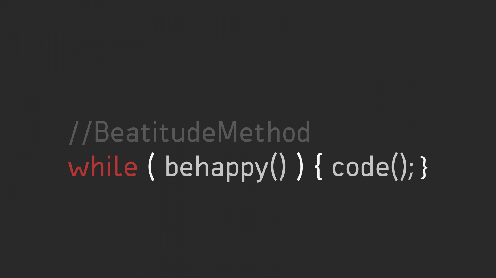
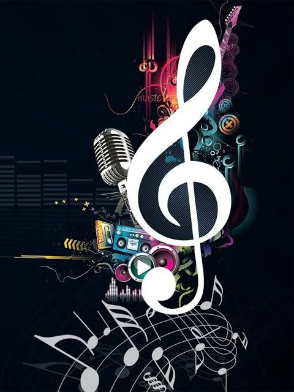

## Hi there 👋, this is Syed Ashlaan Ahmed from Luxembourg !!
#### I am a Developer, Guitar Player and hardcore metal fan!!!

&nbsp;&nbsp;    &nbsp;
 

## About

* I am working as a DevOps Engineer
* I am interested to learn about new technologies
* I love reading books. Big fan of fiction novels.
* I am a professional guitar player and a singer.

---

### Professional Summary

- 2 years experience working as a DevOps Engineer in Amazon.
- Strong programming skill using languages like  C++ Java, Python, NodeJS, Dart, etc.
- Assist development teams and help them build software by having a safety monitoring mechanism, and resolve customer and technical issues.
- Developing and leading, building tools and systems for improving clients and developers experience.

---

## Publications

- Abhijath Ande, Vishnu N Nair and Syed Ashlaan Ahmed, “Smart Authentication based on Modified Merkle Puzzles”, 2021 IEEE Region 10 Symposium (TENSYMP), IEEE, 2021
---

🎸 **Personal interests**

Music, reading and coding are three essential part of my life.

	
| | |
|:-------------------------:|:-------------------------:|
| ||

---